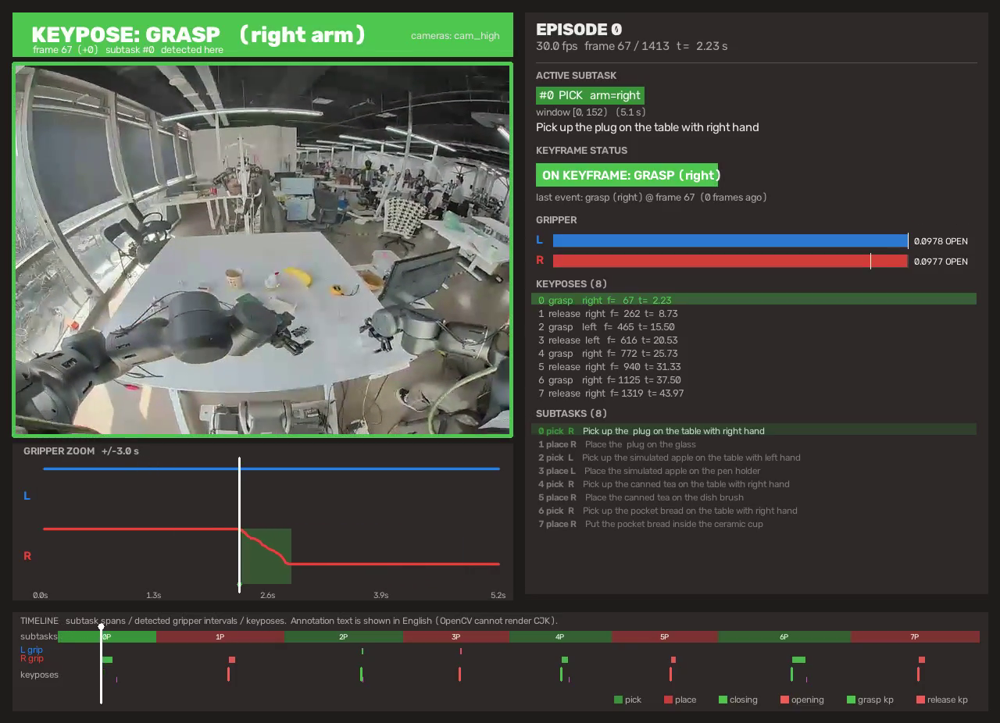
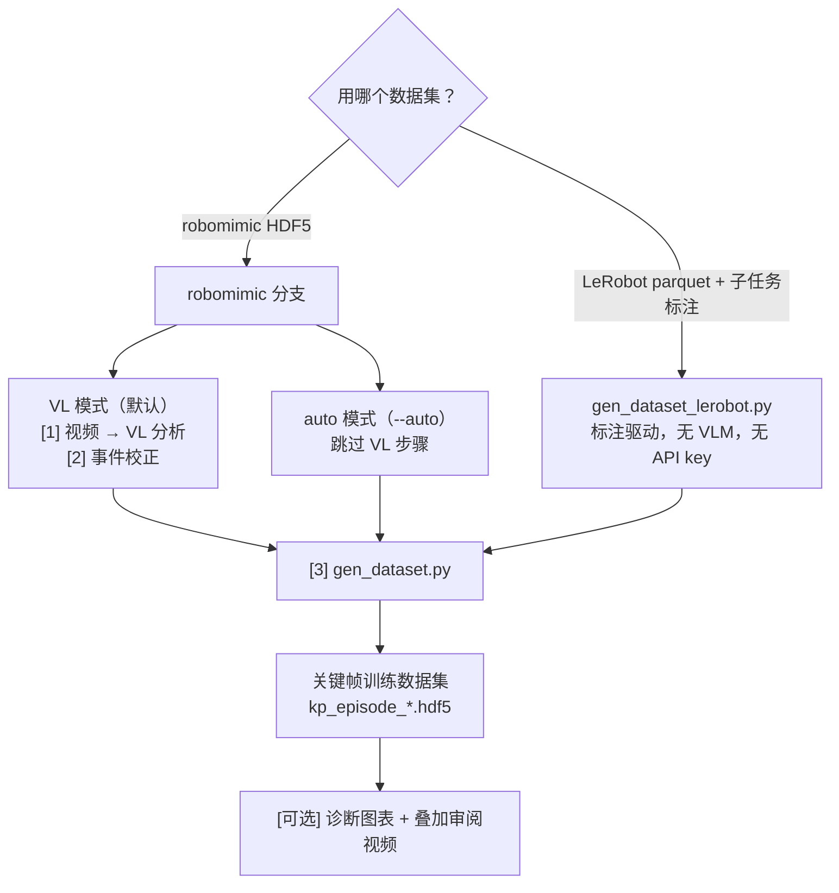

# Keypose Exploration: Efficient Automatic Trajectory Labelling

论文 *Keypose Exploration: Efficient Automatic Trajectory Labelling and
Cross-Embodiment Policy Transfer*，已被 **IROS 2026** 接收。

面向抓取类机器人操作的轨迹自动标注方法：视觉语言模型（VLM）在一条代表性演示上识别
**发生了什么**交互事件（`grasp`、`release`、`detach`、`interact`、`land`），
确定性的轨迹/夹爪分析把每个事件**精确钉到哪一帧**，从而无需逐事件手写规则、
也无需人工标注即可得到关键帧（keypose）标签。

> **仓库状态**：本仓库是 IROS 2026 *Keypose Exploration* 代码库（MIT 许可，
> © 2026 Yupu Lu）的工作副本，在其之上扩展了**标注驱动的 LeRobot 流程**、
> 审阅工具（诊断图表 + 叠加审阅视频）以及一套合成信号测试。原始 LICENSE 与
> 引用信息保持原样；新增内容见下方[两条工作流](#两条工作流)。

## 🎬 效果预览

审阅视频把相机画面与实时关键帧看板叠在一起（**点击图片播放**，示例为
`PickPlaceONLY_Moz1_cjb` 第 0 集）：

[](assets/keypose_review_demo.mp4)

上图这一帧正落在 `grasp` 关键帧上，可以看到：横幅变成实色的 `KEYPOSE: GRASP (right arm)`，
画面被描边，左下夹爪放大图里红色曲线（右臂）**恰好从白色播放头处开始下降**，
右侧看板的 `ON KEYFRAME: GRASP (right)` 与关键帧列表同步高亮。

画面分五块：

| 区域 | 内容 |
|---|---|
| 顶部横幅 | `KEYPOSE: GRASP (right arm)` + 帧号与子任务号；接近关键帧时显示帧距，命中时整条变实色并把画面描边 |
| 左侧画面 | 数据集相机（此处 `cam_high`），按原生分辨率渲染不放大；`--cameras` 可多机位并排 |
| 左下夹爪放大图 | 当前帧 ±3 s 的**逐帧**夹爪曲线，叠加检测到的区间底色与关键帧竖线 —— 用来直接判断"关键帧是否真的落在夹爪动作上" |
| 右侧看板 | 集号/帧号/时间、当前子任务（pick/place、手臂、窗口、英文文本）、关键帧状态、双臂夹爪开合条、全部关键帧与子任务列表 |
| 底部时间线 | 子任务色带、逐臂夹爪区间、关键帧刻度、白色播放头、图例 |

生成方法见[快速上手](#快速上手)与[审阅 LeRobot 结果](#审阅-lerobot-结果)。

> 仓库内只保留这一段演示视频（约 7 MB，为控制体积按 CRF 26 重新编码）。
> 批量输出默认落在 `.gitignore` 的 `data/` 下，不入库。

## 两条工作流

两者都采用同一套"**语义 / 时序**"解耦思路，区别只在于语义阶段（"发生了什么、大致在何时"）
的答案从哪来。

| | **robomimic 模式** | **LeRobot 模式** |
|---|---|---|
| 语义阶段（"大致何时、发生什么"） | VLM 分析演示视频 | `dataset.json` 中的人工子任务标注 |
| 运动数据 | robomimic HDF5 | LeRobot parquet（逐臂夹爪 + 笛卡尔状态） |
| API key | VL 模式需要（`DASHSCOPE_API_KEY`） | **不需要** |
| 入口 | `scripts/run_full_pipeline.sh <task> <N>` | `scripts/06_generate_lerobot_dataset.sh <dataset> <out> <N>` |
| 详细说明 | 见下文 | **[LEROBOT_PIPELINE.md](LEROBOT_PIPELINE.md)** |

两条流程共用同一套确定性内核（`src/trajectory_segmentation_v3.py`）：
Savitzky-Golay 平滑、逐轴速度阈值判定、逐轴运动指纹、考虑方向反转的相位合并、
夹爪开合区间提取。为 LeRobot 新增的参数**默认值全部等于原 robomimic 行为**，
因此两条路径不会产生分歧。

## 引用

```bibtex
@article{lu2026Keypose,
  title={Keypose Exploration: Efficient Automatic Trajectory Labelling and Cross-Embodiment Policy Transfer},
  author={Lu, Yupu and Xu, Hang and Chen, Yizhou and Pan, Jia},
  journal={arXiv preprint arXiv:2606.29028},
  year={2026}
}
```

## 路径配置

所有路径都相对于本目录解析 —— 把 `KEYPOSE_LABELLING_ROBOMIMIC_ROOT` 指向你的
robomimic 数据集（默认会去找 `../../datasets/robomimic`）。
数据在别处时用环境变量覆盖：

```bash
export KEYPOSE_LABELLING_ROBOMIMIC_ROOT=/path/to/robomimic   # 输入数据集
export KEYPOSE_LABELLING_DATA_ROOT=/path/to/generated        # 输出目录（默认 ./data）
export DASHSCOPE_API_KEY=sk-...                              # 仅 VL 模式需要
python config.py square                                      # 打印解析后的路径
```

仓库不内置任何 API key；VL 模式需要环境变量中有 `DASHSCOPE_API_KEY`。

## 快速上手

### LeRobot 数据集 —— 有标注子任务，完全不需要 VLM

数据集本身带子任务标注时（LeRobot `v2.1` 布局：`dataset.json` + 每集一个 parquet）
用这条路径。不需要 API key，也不做视频分析；夹爪信号直接来自 parquet。

```bash
cd scripts

# 跑 N 集
./06_generate_lerobot_dataset.sh /path/to/PickPlaceONLY_Moz1_cjb ./data/lerobot_kp 200

# 审阅：图表（每集一张 + 总览长图）与叠加审阅视频
python ../viz/visualize_lerobot_episode.py --dataset_root /path/to/dataset --num_episodes 20
python ../viz/render_lerobot_video.py     --dataset_root /path/to/dataset --num_episodes 20

# 验证：7 项物理校验 + 失败模式分桶
python ../tests/evaluate_lerobot_keyposes.py   --dataset_root /path/to/dataset --num_episodes 600
python ../tests/diagnose_lerobot_matching.py   --dataset_root /path/to/dataset --num_episodes 200
```

### robomimic 数据集 —— VL 模式或 auto 模式

```bash
cd scripts
# auto 模式：只用轨迹，不需要 VL（快，适合迭代）
./run_full_pipeline.sh --auto can 200           # 单个任务
./run_full_pipeline.sh --auto all               # 三个任务一起跑
./correct_all_tasks.sh --auto                   # 同上（批量封装）

# VL 模式：完整质量（需要 DASHSCOPE_API_KEY，慢）
./run_full_pipeline.sh can 50                   # 完整流程：步骤 1→2→3
./correct_all_tasks.sh                          # 所有任务：步骤 2→3（假设步骤 1 已完成）

# 单集 / 指定若干集
./02_correct_events.sh square 1 "16" qwen3-vl-235b-a22b-thinking       # 只跑第 16 集
./03_generate_dataset.sh square 1 "16"      # 为第 16 集生成数据集
./03_generate_dataset.sh --auto can 200     # auto 模式，直接做步骤 3

# 轨迹可视化
./visualize_all_tasks.sh 5  # 每个任务前 5 集
./05_visualize_trajectory_v3.sh square 16   # 只看第 16 集
```

## 📂 目录结构

```
keypose_labelling/
├── config.py                       # 全局配置（所有路径从这里解析）
├── divide_video.py                 # VL 分析：HDF5 → 视频 → 事件 JSON
├── gen_dataset.py                  # 生成关键帧数据集（VL 模式或 --auto）
├── gen_dataset_lerobot.py          # LeRobot 模式：子任务标注 → 关键帧（无 VLM）
├── merge_trajectory_vl.py          # 单集调试 / 校验
├── hdf5_to_video.py                # 从 HDF5 数据集渲染演示视频
├── LEROBOT_PIPELINE.md             # LeRobot 模式：数据约定、匹配规则、实测指标
├── assets/                         # 仓库内置的媒体资产（仅演示用）
│   ├── keypose_review_demo.mp4             # 审阅视频演示（第 0 集）
│   └── keypose_review_demo_poster.png      # 演示视频的海报帧
├── src/                            # 核心标注模块
│   ├── trajectory_segmentation_v3.py  # 逐轴运动 + 夹爪分段（唯一事实来源）
│   ├── event_corrector_v3.py       # 语义-运动事件校正
│   ├── lerobot_utils.py            # LeRobot 适配层（parquet、标注、参数 profile）
│   ├── subtask_keypose.py          # 标注驱动的关键帧提取
│   ├── trajectory_utils.py         # 轨迹读取工具
│   └── vl_parser.py                # VL JSON 解析器
├── task/                           # 数据集/任务适配
│   ├── robomimic.py                # robomimic 任务配置
│   └── utils.py
├── viz/                            # 可视化工具
│   ├── visualize_trajectory_v3.py  # 分段 + 校正时间线图
│   ├── visualize_lerobot_episode.py   # LeRobot：每集诊断图（+ 批量总览长图）
│   ├── render_lerobot_video.py        # LeRobot：审阅视频（画面 + 实时关键帧看板）
│   └── reorganize_and_visualize.py # 重整事件到每集目录 + 抽取事件帧
├── scripts/                        # 流水线 Shell 驱动（*.sh）
│   ├── run_full_pipeline.sh        # robomimic 顶层入口（支持 --auto）
│   ├── correct_all_tasks.sh        # 批量所有任务（支持 --auto）
│   ├── 01_prepare_videos.sh        # 步骤 1：HDF5 → 视频 + VL 分析
│   ├── 02_correct_events.sh        # 步骤 2：轨迹事件校正
│   ├── 03_generate_dataset.sh      # 步骤 3：生成训练 HDF5（--auto）
│   ├── 04_visualize_events.sh      # 可视化事件及其帧
│   ├── 05_visualize_trajectory_v3.sh  # 可视化轨迹分析
│   ├── 06_generate_lerobot_dataset.sh # LeRobot：标注驱动的关键帧生成
│   └── config.sh                   # Shell 配置（读取 config.py）
├── tests/                          # 测试 + 参数分析工具
│   ├── test_v3_segmentation.py
│   ├── test_correction_rules.py
│   ├── test_lerobot_gripper_segmentation.py  # 合成信号单测（不需要数据集）
│   ├── evaluate_lerobot_keyposes.py          # 7 项物理校验
│   ├── diagnose_lerobot_matching.py          # 失败模式分桶
│   ├── optimize_thresholds.py      # 用速度分布标定逐任务阈值 theta^k
│   └── analyze_window_size.py      # 用运动尺度标定平滑窗口 w
└── data/                           # 运行期生成（已 git-ignore）
    ├── divided_events/{task}/json_sg/       # VL 模型分析输出
    ├── corrected_events/{task}/             # 轨迹校正后的事件
    └── corrected_events_organized/{task}/episode_N/
        ├── events.json             # 校正后的事件
        ├── intervals.json          # 轨迹区间
        ├── correction_flow.txt     # 人类可读日志
        └── frames/                 # 事件帧图片
```

## 📋 流程总览



robomimic 分支的两种模式对比：

| 步骤 | VL 模式（默认） | auto 模式（`--auto`） |
|---|---|---|
| 1 | `01_prepare_videos.sh`：HDF5 → 视频 → VL 分析 → `data/divided_events/` | 跳过（不需要 VL） |
| 2 | `02_correct_events.sh`：把 VL 事件匹配到轨迹 → `data/corrected_events/` | 跳过（不需要 VL） |
| 3 | `03_generate_dataset.sh` → `gen_dataset.py`（消费 VL 事件） | `03_generate_dataset.sh --auto` → `gen_dataset.py --auto`（基于夹爪的伪事件） |
| 入口 | `run_full_pipeline.sh <task> <N>` | `run_full_pipeline.sh --auto <task> [N]` |

**什么时候用哪个模式：**

- **LeRobot 模式**：数据集已经带子任务标注 —— 完全跳过 VLM
- **auto 模式**：robomimic 数据，快速迭代，无 API 开销，适合早期实验
- **VL 模式**：robomimic 数据，正式质量，能理解语义事件，复杂任务效果更好

### LeRobot 模式（Moz1 数据集，完全不用 VLM）

Moz1 采集的 LeRobot 数据集在 `dataset.json` 里带**人工子任务标注**，
其作用与 VL 输出完全一致（"发生了什么、大致在何时"）。因此语义阶段是"免费"的，
整个 VLM 半程都被跳过（命令见[快速上手](#快速上手)）。

夹爪信号存在于每集的 **parquet** 文件里
（`<arm>_gripper_state_pos` / `<arm>_gripper_cmd_pos`），不在视频里；
确定性分析把每个标注窗口转成一个精确的关键帧。
在 `PickPlaceONLY_Moz1_cjb`（600 集）上，子任务匹配率达到 100%，
且每个关键帧都落在其标注窗口内、并且落在真实的夹爪动作上。

数据约定、匹配规则、调参入口与实测指标见
**[LEROBOT_PIPELINE.md](LEROBOT_PIPELINE.md)**。

## 🔑 核心特性

- **标注驱动（无 VLM）**：带子任务标注的 LeRobot 数据集可跳过整个 VLM 半程 ——
  确定性、可复现、不需要 API key
- **VL 引导**：对没有标注的数据集，用视觉语言模型（Qwen、GPT-4V）做事件检测
- **物理证据校验的匹配**：一个子任务物理上只能消耗一个夹爪动作，因此当标注文本与
  夹爪信号矛盾时以夹爪为准（写错手、pick 实际是放置、pick+place 被合并成一段）
- **鲁棒匹配**：能处理多物体任务、attach 场景（挂/放）
- **双位姿提取**：同时给出末端位姿（epos）与关节角（qpos）
- **夹爪平滑**：避免连续夹爪动作被切碎；合并两段式夹取与低于阈值的缓慢夹紧
- **审阅工具链**：每集诊断图、批量总览长图、带实时关键帧看板的叠加审阅视频
- **可批量生产**：完整的批处理与错误处理

## 📂 核心文件

### 配置
- `config.py` - 所有路径与设置的唯一事实来源
- `scripts/config.sh` - Shell 配置（从 config.py 读取）

### Shell 脚本（`scripts/`）
- `run_full_pipeline.sh` - robomimic 的**顶层入口**（`--auto` 跳过 VL 步骤 1-2）
- `correct_all_tasks.sh` - 批量所有 3 个任务（支持 `--auto`）
- `01_prepare_videos.sh` - 步骤 1：HDF5 → 视频 + VL 分析（开销大）
- `02_correct_events.sh` - 步骤 2：VL 事件校正
- `03_generate_dataset.sh` - 步骤 3：生成训练 HDF5（支持 `--auto`）
- `06_generate_lerobot_dataset.sh` - **LeRobot 入口**：标注驱动的关键帧生成
- `config.sh` - Shell 配置（从 config.py 读取）

### 主 Python 脚本（根目录）
- `divide_video.py` - VL 分析（视频 → 事件 JSON）
- `gen_dataset.py` - 生成关键帧数据集（VL 模式或 `--auto` 模式）
- `gen_dataset_lerobot.py` - 从 LeRobot 标注生成关键帧数据集（无 VLM）
- `merge_trajectory_vl.py` - 单集调试 / 校验
- `hdf5_to_video.py` - 从 HDF5 数据集渲染演示视频

### 核心模块（`src/`）
- `trajectory_segmentation_v3.py` - 逐轴运动 + 夹爪分段（唯一事实来源）
- `event_corrector_v3.py` - 上下文感知的事件匹配
- `lerobot_utils.py` - LeRobot 适配层：parquet 读取、子任务标注解析、调好的 profile
- `subtask_keypose.py` - 标注驱动的关键帧提取（替代 VLM + 校正器）
- `trajectory_utils.py` - 从 HDF5 读取轨迹（epos + qpos）
- `vl_parser.py` - 解析 VL JSON 输出

### 可视化（`viz/`）
- `visualize_trajectory_v3.py` - 分段 + 校正时间线图（从 `src/` 导入）
- `visualize_lerobot_episode.py` - LeRobot 每集诊断图 + 批量总览长图
- `render_lerobot_video.py` - LeRobot 审阅视频：画面 + 实时关键帧看板、夹爪放大图、时间线
- `reorganize_and_visualize.py` - 把校正后事件整到每集目录 + 抽取事件帧

### 测试（`tests/`）
- `test_v3_segmentation.py` - 分段冒烟测试
- `test_correction_rules.py` - 事件校正的校验测试
- `test_lerobot_gripper_segmentation.py` - 34 项合成信号单元测试（不需要数据集）
- `evaluate_lerobot_keyposes.py` - 批量跑 7 项物理校验
- `diagnose_lerobot_matching.py` - 把所有未匹配按失败模式分桶
- `optimize_thresholds.py` - 分析逐轴速度分布，用于标定逐任务阈值 $\theta^k$
- `analyze_window_size.py` - 分析轨迹运动尺度，用于标定平滑窗口 $w$

`test_lerobot_gripper_segmentation.py` 也可以直接单独运行
（`python tests/test_lerobot_gripper_segmentation.py`）——
因为本集群上直接跑 `pytest` 会一路往上扫到 `/mnt` 并撞上无权限挂载点；
若想用 pytest，请加 `pytest -c /dev/null --rootdir=. <文件>`。

## 📊 数据结构

### 轨迹（末端位姿）
```python
epos: (T, 9) 数组
    [pos_x, pos_y, pos_z,           # 位置 (3)
     quat_w, quat_x, quat_y, quat_z, # 姿态四元数 (4)
     gripper_left, gripper_right]    # 夹爪关节 (2)

qpos: (T, 7) 数组
    [joint_1, joint_2, ..., joint_7] # 机器人关节角
```

### 关键帧字典
```python
keyposes = {
    'frames': [10, 45, 89],              # 帧索引
    'epos': [[x,y,z,qw,qx,qy,qz,g1,g2],  # 关键帧处末端位姿 (K, 9)
             [...],
             [...]],
    'qpos': [[j1,j2,j3,j4,j5,j6,j7],     # 关键帧处关节角 (K, 7)
             [...],
             [...]],
    'event_types': ['grasp', 'release', 'attach_hang']
}
```

### 夹爪动作流
```python
action_gripper: (T,) 数组
    -1 = 张开夹爪
     1 = 闭合夹爪
     0 = 无动作（保持）
```

## 🎯 事件类型

### 交互事件
- **`grasp`**：机器人闭合夹爪抓住物体
- **`release`**：机器人张开夹爪释放物体
- **`detach`**：物体离开桌面/夹具
- **`attach_hang`**：物体在被持有时接触目标（悬挂场景）
- **`attach_drop`**：物体在释放后落到表面（放置场景）

### attach 场景

#### attach_hang（release 之前）
```
时间线: grasp → 移动 → [ATTACH] → release
示例:   把手工具挂到洞洞板上
匹配到: release 之前的最后一段运动区间
```

#### attach_drop（release 之后）
```
时间线: grasp → 移动 → release → [ATTACH]
示例:   把罐子丢进箱子里
匹配到: 张开之后的静止区间
```

## 🔧 常用任务

### 生成关键帧数据集（robomimic）
```bash
# 推荐：用顶层流水线脚本
cd scripts
./run_full_pipeline.sh --auto can 200          # auto 模式（快，无 VL）
./run_full_pipeline.sh can 50                  # VL 模式（完整质量）

# 或直接调用 gen_dataset.py
python gen_dataset.py \
    --hdf5_path ./data/robomimic/datasets/can/ph/low_dim_abs.hdf5 \
    --output_dir ./data/robomimic/datasets/can/ph/kp_training \
    --num_episodes 200 --task can --auto

# VL 模式（需要步骤 1-2 产出的校正事件）
python gen_dataset.py \
    --hdf5_path ./data/robomimic/datasets/can/ph/low_dim_abs.hdf5 \
    --vl_json_dir ./data/corrected_events/can \
    --output_dir ./data/robomimic/datasets/can/ph/kp_training \
    --num_episodes 50 --task can
```

### 调试单集
```bash
python merge_trajectory_vl.py \
    --hdf5_path ./data/robomimic/datasets/can/ph/low_dim_abs.hdf5 \
    --vl_json ./keypose/corrected_events/can/json_sg/imglist_episode_0_*.json \
    --episode 0 \
    --output_dir ./debug/
```

### 对视频做 VL 分析
```bash
python divide_video.py \
    --dataset_folder ./data/robomimic/datasets/can/ph/ \
    --task can \
    --model max \
    --target_fps 10
```

### 从 LeRobot 数据集生成关键帧
```bash
# 整个数据集 / 指定集数 / 指定集列表
./scripts/06_generate_lerobot_dataset.sh /path/to/PickPlaceONLY_Moz1_cjb ./data/lerobot_kp 200

python gen_dataset_lerobot.py \
    --dataset_root /path/to/PickPlaceONLY_Moz1_cjb \
    --output_dir ./data/lerobot_kp \
    --episode_list 0,3,7 --verbose

# 临时覆盖参数（完整清单见 LEROBOT_PIPELINE.md）
python gen_dataset_lerobot.py --dataset_root ... --output_dir ... \
    --threshold_x 0.025 --threshold_y 0.025 --threshold_z 0.018 \
    --window_size 41 --search_radius 15
```

### 审阅 LeRobot 结果

仓库内已有一段现成的演示视频：`assets/keypose_review_demo.mp4`
（画面说明见顶部[效果预览](#-效果预览)）。

```bash
# 每集一张图 + 一张总览长图
python viz/visualize_lerobot_episode.py --dataset_root ... --num_episodes 20

# 叠加审阅视频：画面 + 实时关键帧看板
python viz/render_lerobot_video.py --dataset_root ... --num_episodes 20
#   --cameras cam_high,cam_left_wrist,cam_right_wrist   多机位并排
#   --hold_frames 10 --speed 0.5                        每个关键帧多停 10 帧

# 批量校验与失败模式分析
python tests/evaluate_lerobot_keyposes.py --dataset_root ... --num_episodes 600 --report eval.csv
python tests/diagnose_lerobot_matching.py --dataset_root ... --num_episodes 200
python tests/test_lerobot_gripper_segmentation.py      # 34 项单测，不需要数据集
```

## 🛠️ 调参

### 轨迹分段（robomimic）
```python
segment_trajectory(
    trajectory,
    action_gripper,
    position_threshold=5e-3,    # 位置变化 5mm
    rotation_threshold=1e-2,    # 姿态变化约 0.6°
    gripper_threshold=1e-4,     # 夹爪关节变化
    stable_window=5,            # 连续 5 个时间步视为静止
    max_gap=5                   # 填补 ≤5 个时间步的空隙
)
```

**关键参数** `max_gap`：
- **调大 (10)**：更强的平滑，会连接相隔较远的区间
- **调小 (1)**：保守平滑，只填补单帧空隙
- **默认 (5)**：多数任务的平衡点

### LeRobot 参数 profile

LeRobot 流程由 `src/lerobot_utils.py` 里的具名 profile
（`LEROBOT_PROFILES['moz1']`）配置，而不是用上面的 robomimic 默认值 ——
因为实机夹爪需要不同的处理：

| 键 | 含义 |
|---|---|
| `thresholds` | 逐轴速度阈值（m/s），用于运动/静止判定 |
| `window_size` | Savitzky-Golay 平滑窗口（帧，奇数） |
| `merge_hiccup_gaps` | 合并 `闭 → 短暂开 → 闭` 的两段式夹取 |
| `interrupted_action_gap` | 合并被"低于阈值的缓慢平台期"打断的同一方向动作 |
| `min_short_travel` | 救回过短区间所需的位移（m）——单帧弹开释放是真实事件 |
| `mask_whole_command_run` | 此处为 `False`：夹爪指令是连续设定值，会滞后于实测状态 |
| `min_movement_between` | 设为 `0` 即关闭"修正动作"启发式，否则会删掉真实的无位移抓取 |

这些参数在未设置时**全部回退到原 robomimic 行为**，因此共用的
`segment_trajectory_v3()` 已在 360 组随机合成的 robomimic 风格输入上验证：
默认参数下的输出与原实现**逐条完全一致**。
完整对照表见 **[LEROBOT_PIPELINE.md](LEROBOT_PIPELINE.md#5-调参入口)**。

## 📦 输出数据集

### robomimic 模式

```
keypose_dataset.hdf5
  ├── obs/
  │   ├── env_obs            # (T, 23) 环境观测 [物体(14), 机器人(9)]
  │   ├── epos               # (T, 9) 末端位姿
  │   ├── qpos               # (T, 7) 关节角（可选）
  │   ├── prev_keypose       # (T, 9) 上一个关键帧的 epos
  │   └── images/            # 相机视图（若启用）
  ├── target/
  │   ├── next_keypose       # (T, 9) 下一个关键帧的 epos
  │   ├── event_type         # (T,) 事件类型索引
  │   ├── keypose_frames     # (K,) 关键帧索引
  │   ├── keypose_epos       # (K, 9) 关键帧末端位姿
  │   ├── keypose_qpos       # (K, 7) 关键帧关节角（可选）
  │   └── keypose_types      # (K,) 事件类型字符串
  └── actions                # (T, action_dim) 机器人动作 [已包含]
```

### LeRobot 模式

```
<output_dir>/
  ├── kp_episode_<i>.hdf5            # 训练张量（每集一个文件）
  ├── events_episode_<i>.json        # 全部事件 + 逐子任务诊断信息
  ├── timelines_episode_<i>.txt      # 人类可读的分段时间线
  └── summary.csv                    # 每集匹配率

kp_episode_<i>.hdf5
  ├── obs/
  │   ├── epos              # (T, 9) 当前活跃手臂的末端位姿
  │   ├── left_epos         # (T, 9)
  │   ├── right_epos        # (T, 9)
  │   ├── prev_keypose      # (T, 9) 最近到达的关键帧
  │   ├── active_arm        # (T,)  0 = 左, 1 = 右
  │   └── subtask_index     # (T,)  t 时刻所处的标注子任务
  ├── target/
  │   ├── next_keypose      # (T, 9) 下一个要到达的关键帧
  │   ├── event_type        # (T,) 0 无 / 1 grasp / 2 release / 3 detach / 4 attach_drop
  │   ├── stage_index       # (T,) 正在追第几个关键帧，范围 [0, K]
  │   ├── keypose_frames    # (K,)
  │   ├── keypose_epos      # (K, 9)
  │   ├── keypose_qpos      # (K, 7)
  │   ├── keypose_types     # (K,) 字符串
  │   └── keypose_arm       # (K,) 每个关键帧的 'left' / 'right'
  ├── actions/              # <arm>_cmd_cart_pos, <arm>_cmd_joint_pos,
  │                         # <arm>_gripper_cmd_pos, vector (T, 28)
  └── meta/                 # attrs: fps, num_frames, num_keyposes, arms, arm_ids
```

## ❓ 常见问题

### 为什么用 epos 而不是 qpos？
为了清晰。在 robomimic 数据集里：
- `qpos` = 关节角（7 自由度机械臂是 7 维）
- `epos` = 末端位姿（9 维：位置 + 四元数 + 夹爪）

关键帧用的是末端数据，所以正确的叫法是 `epos`。

### 夹爪动作会被平滑吗？
会。通过 `trajectory_segmentation.py` 里的 `_fill_gripper_gaps()`，
避免一次连续的夹爪动作被切成碎片。

### 如果有多个闭合区间怎么办？
按时间顺序处理：第一次 grasp 对应第一个闭合，第二次 grasp 对应第二个闭合，依此类推。

### VL 视频分析是怎么跑的？
用 `divide_video.py`（基于子任务划分，使用 Qwen3-VL 模型）——
它产出每集的事件 JSON，供后续校正步骤消费。

### 物体会从夹爪滑落吗？
不处理。前提是干净的 grasp → release → grasp 序列。
如果发生滑落，应当由 VL 输出 `detach` 事件来体现。

### LeRobot 模式下夹爪信号从哪来？
来自每集的 **parquet**，不是视频：`<arm>_gripper_state_pos` 是实测值，
`<arm>_gripper_cmd_pos` 用于识别"指令与实测矛盾"的帧。
视频第 *i* 帧与 parquet 第 *i* 行是对齐的（同为数据集 fps），因此不涉及重采样。

### 标注文本和夹爪信号矛盾时听谁的？
听夹爪的。一个子任务物理上只能消耗一个夹爪动作，因此：
`pick` 窗口里只有 `opening` 时改判为 `release`；
标注写错手时切换到另一只手臂；
`无法标注` 的窗口保留其中包含的全部动作。
每一处这类修正都记录在 `events_episode_*.json`
（`kind_source` / `arm_source` / `message`）中，保持可审计。

## 📚 文档

- `LEROBOT_PIPELINE.md` - LeRobot 模式：数据约定、匹配规则、调参入口、实测指标
- `scripts/README.md` - 演示脚本使用说明

---

*最后更新：2026-09-16*
